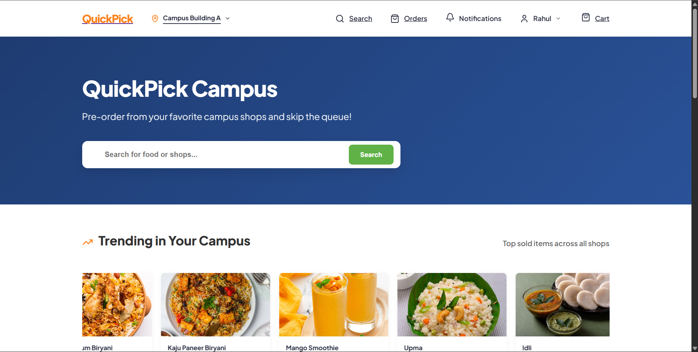
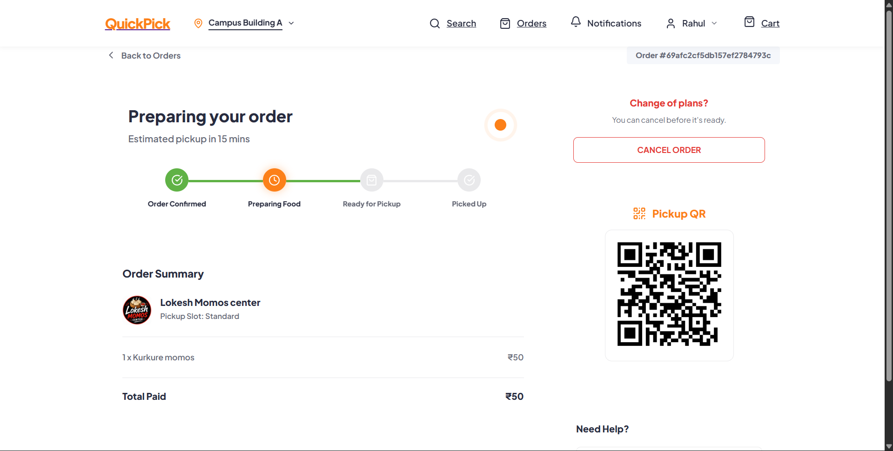
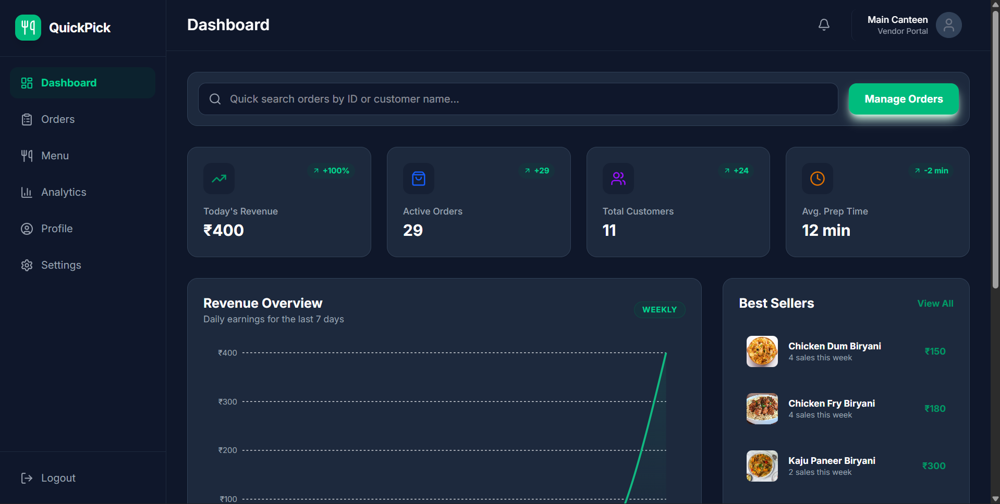
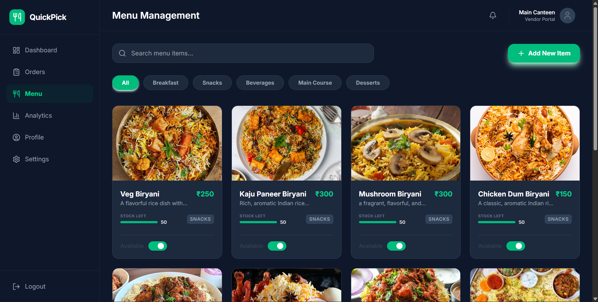
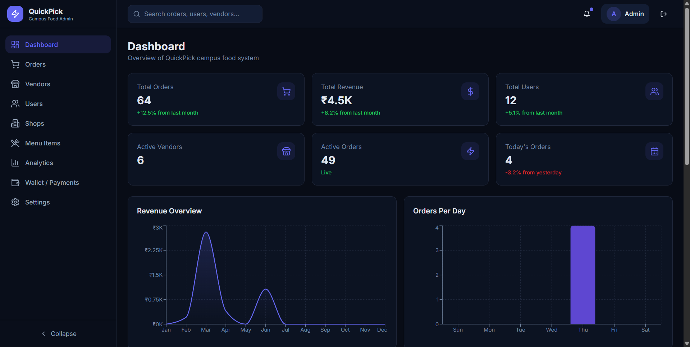
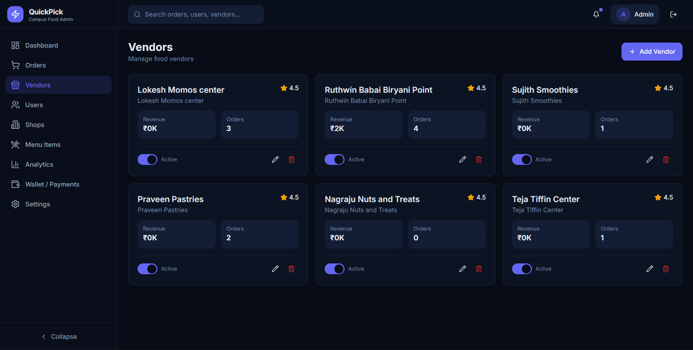
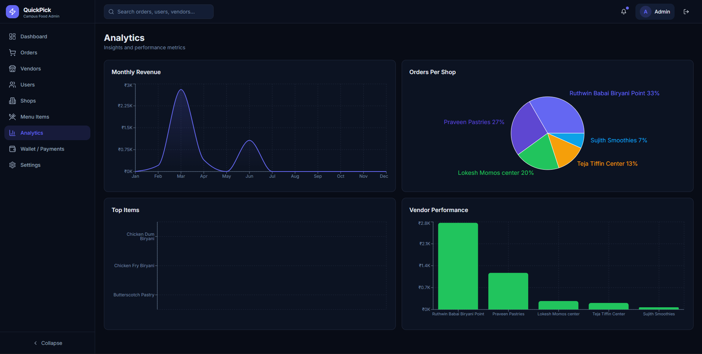

# QuickPick Campus


A campus food ordering and analytics platform built with logical multi-tenancy for scalable college ecosystems.

---

## Why QuickPick Campus?

Students often spend more time waiting in food queues than actually eating.

QuickPick Campus was built to solve this problem by digitizing food ordering and campus vendor management while enabling administrators to monitor operations from a centralized platform.

The platform connects:

* Students → Browse vendors, place orders, track orders
* Vendors → Manage menus and process incoming orders
* Administrators → Monitor platform activity and analytics

The system is designed with logical multi-tenancy in mind, enabling future expansion to support multiple colleges while maintaining isolated data boundaries.

---

# Features

## Student Portal

* User registration and authentication
* Browse campus vendors
* Search functionality
* Add items to cart
* Place orders
* Order history
* Order tracking
* Profile management

## Vendor Portal

* Vendor authentication
* Shop creation and management
* Menu management
* Upload food images
* Manage incoming orders
* Analytics dashboard
* Profile management

## Admin Portal

* Admin authentication
* Manage vendors and users
* Campus analytics dashboard
* Platform monitoring
* Vendor approvals and management

---

# Multi Tenant Architecture

QuickPick Campus is designed using logical multi-tenancy.

Every core entity belongs to a college.

```text
College
│
├── Users
│    ├── Students
│    ├── Vendors
│    └── Admin
│
├── Vendors
│     └── Menu Items
│
└── Orders
      ├── Student
      └── Vendor
```

This architecture ensures:

* Data isolation between colleges
* Scalability without separate databases
* Secure access control
* Easier expansion to multiple campuses

---

# Authentication & Security

* JWT Authentication
* Role Based Authorization
* Protected Routes
* Middleware Based Authentication
* Route Level Access Control
* Global Error Handling

---

# System Architecture

```text
Student Frontend ──┐

Vendor Frontend ───┼── Backend API ─── MongoDB

Admin Frontend ────┘
```

---

# Tech Stack

## Frontend

* React
* TypeScript
* Vite
* Tailwind CSS
* React Router

## Backend

* Node.js
* Express.js
* MongoDB
* Mongoose
* JWT Authentication

## Additional Tools

* Swagger API Documentation
* Cloudinary Image Uploads
* Render Deployment
* Vercel Deployment

---

# Repository Structure

```text
quick-pick/

├── backend/
│   ├── src/
│   │   ├── controllers/
│   │   ├── models/
│   │   ├── routes/
│   │   └── middlewares/
│
├── frontend/
│   ├── student-frontend/
│   ├── vendor-frontend/
│   └── admin-frontend/
│
├── screenshots/
├── README.md
└── SYSTEM_ARCHITECTURE.md
```


---

# Screenshots

## Student Portal

Student Dashboard


---

Order Tracking



## Vendor Portal

Vendor Dashboard


---

Menu Items




## Admin Portal

Admin Dashboard


---

All Vendors


---

Analytics




---

# Local Setup

## Clone Repository

```bash
git clone https://github.com/Chandrasekhar-5/quick-pick.git

cd quick-pick
```

## Backend Setup

```bash
cd backend

npm install

npm run dev
```

Create a `.env`

```env
PORT=5000

MONGO_URI=your_mongodb_uri

JWT_SECRET=your_secret

NODE_ENV=development
```

---

## Student Frontend

```bash
cd frontend/student-frontend

npm install

npm run dev
```

---

## Vendor Frontend

```bash
cd frontend/vendor-frontend

npm install

npm run dev
```

---

## Admin Frontend

```bash
cd frontend/admin-frontend

npm install

npm run dev
```

---

# API Documentation

Swagger documentation is integrated for backend APIs.

Run backend and visit:

```text
http://localhost:5000/api-docs
```

---

# Deployment

Backend Deployment:

* Render

[Backend API](https://quickpick-backend-4zyr.onrender.com/)

Frontend Deployment:

* Vercel

- [Landing page](https://quick-pick-landing-page.vercel.app/)
- [Student Portal](https://quick-pick-student.vercel.app/)
- [Vendor Portal](https://quick-pick-vendor.vercel.app/login)
- [Admin Portal](https://quickpickops.vercel.app/)

---

# Challenges Solved

* Multi tenant architecture
* Managing multiple frontend applications
* Role based authentication
* Scalable component architecture
* Integrating analytics with operational workflows
* Building separate experiences for students, vendors, and administrators

---

# Future Improvements

* Payment Gateway Integration
* Wallet Transactions
* Real Time Notifications
* Containerization using Docker
* CI/CD Pipeline
* Enhanced Analytics

---

# Contributors

* Alen Alexander
* Vaishnav K
* B. Prasanth
* V. Chandrasekhar
* Ch. Gowtham
* U. Amaresh
* V. Praveen Kumar
* Hitesh Rahul

---

# License

Proprietary Software.

Unauthorized use, distribution, or reproduction is prohibited.

---

Built to simplify campus food ordering through scalable architecture and role-based workflows.
